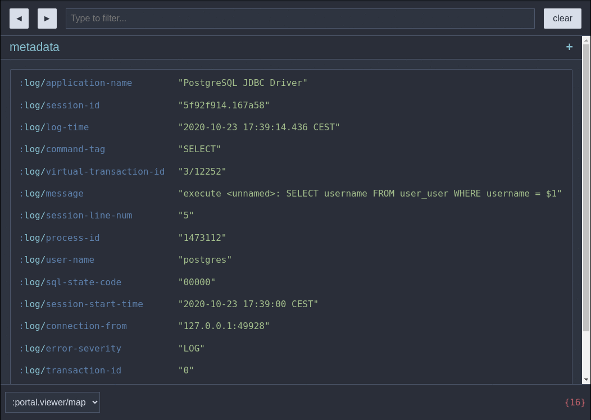

[](LICENSE)

# Postgresql log viewer

- parses and shows postgresql logs (fed from standard input)
- if the log contains query, it fills query params so that query can be copied and executed
- formats queries when user navigates into `:log/message` in ui




## Usage

Just replace `<sha>` in the following command with some commit hash (probably latest on `master` branch) and you should see opened browser window with postgres logs>

```shell
tail -f /var/lib/pgsql/data/log/postgresql.csv | clojure -Sdeps '{:deps {github-nenadalm/postgresql-log-viewer {:git/url "https://github.com/nenadalm/postgresql-log-viewer" :sha "<sha>"}}}' -M:portal
```

### UI

#### [Portal](https://github.com/djblue/portal#portal)

Command window: `Ctrl+Shift+P` or `Meta+Shift+P`

See [this video](https://youtu.be/gByyg-m0XOg?t=175) on how it can be used.

#### [Reveal](https://vlaaad.github.io/reveal/)

Replace `-M:portal` with `-M:reveal` in usage section in order to use this ui.

## Requirements

### Postgresl settings

```
# this tool parses csv log only
log_destination = 'csvlog'

# in order to see statements in log, this has to be enabled
log_statement = 'all'
```

### Installed software

- [Google Chrome](https://www.google.com/chrome/) or [Chromium](https://www.chromium.org/Home)
- [Clojure cli tools](https://clojure.org/guides/getting_started#_clojure_installer_and_cli_tools)
