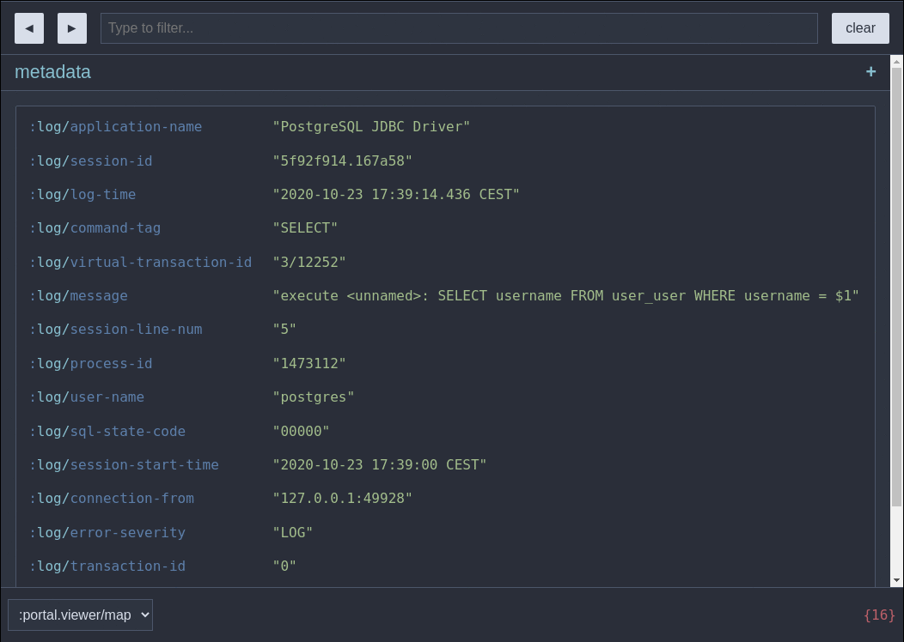

[](LICENSE)

# Postgresql log viewer

- parses and shows postgresql logs (fed from standard input)
- if the log contains query, it fills query params so that query can be copied and executed
- formats queries when user navigates into `:log/message` in ui




## Usage

First download jar in [releases](https://github.com/nenadalm/postgresql-log-viewer/releases) then follow instructions for specific ui below.

### UI

#### [Portal](https://github.com/djblue/portal#portal)

```shell
tail -f /var/lib/pgsql/data/log/postgresql-$(date +%a).json | java -jar ./plv-portal.jar
```

Command window: `Ctrl+Shift+P` or `Meta+Shift+P`

See [this video](https://youtu.be/gByyg-m0XOg?t=175) on how it can be used.

#### [Reveal](https://vlaaad.github.io/reveal/)

```shell
tail -f /var/lib/pgsql/data/log/postgresql-$(date +%a).json | java -jar ./plv-reveal.jar
```

## Requirements

### Postgresql settings

#### file
```
# this tool parses json log only
log_destination = 'jsonlog'

# in order to see statements in log, this has to be enabled
log_statement = 'all'

# log to a file
logging_collector = on
log_filename = 'postgresql-%a.log'
```

### sql
```
-- this tool parses json log only
ALTER SYSTEM SET "log_destination" = 'jsonlog';

-- in order to see statements in log, this has to be enabled
ALTER SYSTEM SET "log_statement" = 'all';

-- log to a file
ALTER SYSTEM SET "logging_collector" = 'on';
ALTER SYSTEM SET "log_filename" = 'postgresql-%a.log';
```

### Installed software

- [Google Chrome](https://www.google.com/chrome/) or [Chromium](https://www.chromium.org/Home)
- [Clojure cli tools](https://clojure.org/guides/getting_started#_clojure_installer_and_cli_tools) - required only when running from source


## Docker usage

```
docker exec <name> bash -c 'tail -f ${PGDATA}/log/postgresql-$(date +%a).json' | clojure -M:portal
```
